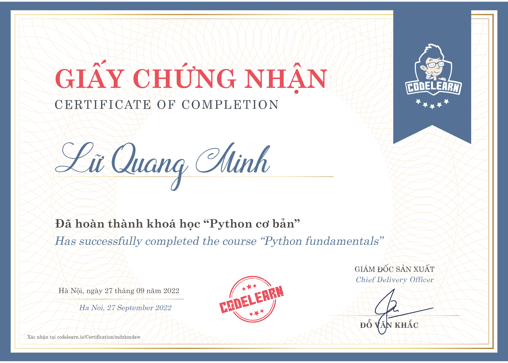
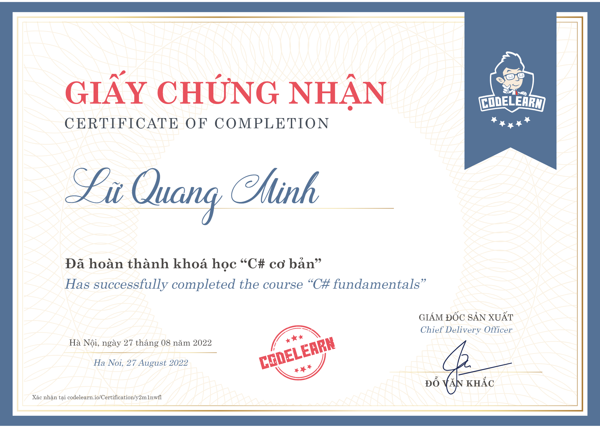
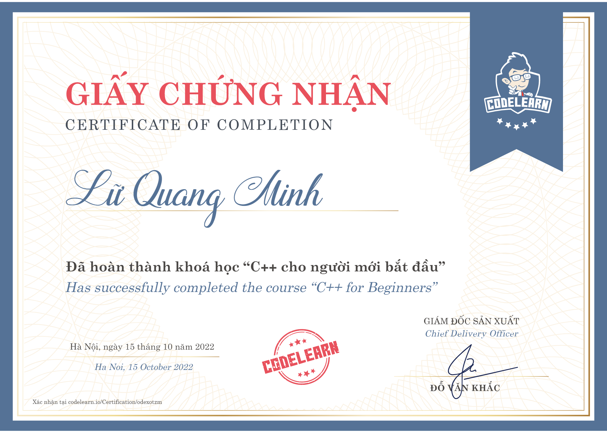

<h1 align="center">Hi 👋, I'm Lữ Quang Minh</h1>

<h3 align="center">A passionate developer from Vietnam </h3>

 

- ✍ I'm a student of: [Saigon University](https://sgu.edu.vn/) (SGU).

- 🌱 I’m currently learning **Front-end.**

## 📫 How to reach me:

   
   
  
  

## Skills:

  
  
  
  
  
  
  

<table style="width:100%;">
  <tr>
    <td>
      
      
    </td>
    <td>
      
 
        
      

    </td>
  </tr>
</table>

# Certificates:

  

  
  

  
  

# Projects I'm working on with Nodemy's guidance:
  

    
  

 
## Snake eating my contribution graph

